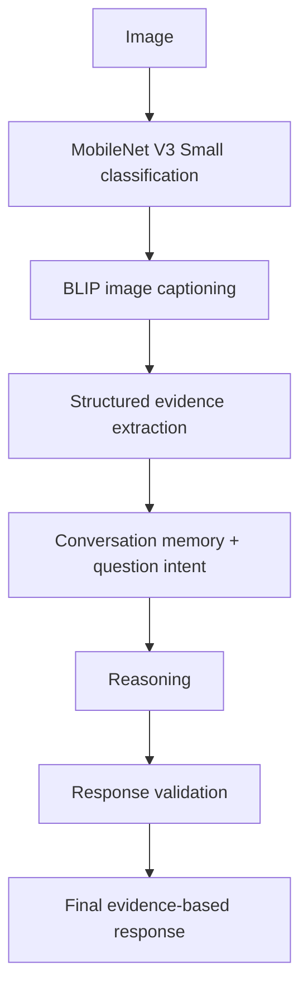

# ElevanceSkills Data Science / GenAI Internship


**Student:** Poojitha Rebbalapalli
**Program:** B.Tech – Information Technology
**Internship:** ElevanceSkills Data Science / GenAI Internship
**Training project context:** *Learn To Build A Real Time Gen AI Customer Service Bot*
**Repository:** https://github.com/poojitharebbalapalli496-netizen/ElevanceSkills_Internship

---

## Overview

This repository contains all six internship tasks in a single GitHub repository, as instructed. Each task builds on the customer-service bot training project as an additional feature, model, or experiment, and each task folder has its own implementation, `requirements.txt`, README, and screenshots/testing evidence where applicable.

This README summarizes **what I understood, what I implemented, what I tested, and what I documented.**

All applications run **locally** using Streamlit. No cloud deployment or production hosting is claimed.

---

## Task Progression

| Task | Focus | Core Technologies | Folder |
|------|-------|-------------------|--------|
| 1 | Sentiment analysis customer-service chatbot | Streamlit, Hugging Face Transformers, CardiffNLP Twitter-RoBERTa | `Task1_Sentiment_Chatbot/` |
| 2 | Medical question answering and retrieval | MedQuAD, TF-IDF, cosine similarity, spaCy NER + EntityRuler | `Task2_Medical_QA/` |
| 3 | Dynamic semantic knowledge base | ChromaDB, Sentence Transformers (`all-MiniLM-L6-v2`) | `Task3_Dynamic_Knowledge_Base/` |
| 4 | Research assistance | Search engine, information extraction, summarization, LLM explainer, visualization | `Task4_Research_Expert_Chatbot/` |
| 5 | Multimodal image + text reasoning | MobileNet V3 Small, BLIP captioning, evidence extraction, validation | `Task5_Multimodal_AI_Assistant/` |
| 6 | Multilingual conversational assistance | Language detection, translation, intent resolution, validation | `Task6_Multilingual_AI_Assistant/` |

---

## Task 1 – Sentiment Analysis Customer Service Chatbot

A Streamlit chatbot that classifies customer messages and responds according to the detected sentiment.

**Implemented**
- Pretrained Hugging Face sentiment model (CardiffNLP Twitter-RoBERTa)
- Positive, negative, and neutral sentiment detection with a displayed confidence score
- Confidence-threshold handling
- Sentiment-appropriate customer-service responses
- Error handling
- Streamlit resource caching for model loading

**Tested**
- Positive, negative, and neutral customer messages
- Automated tests in `test_app.py` (passed)

**Documented:** task README and screenshots in `Task1_Sentiment_Chatbot/screenshots/`.

---

## Task 2 – Medical Question Answering Chatbot

A retrieval-based medical Q&A chatbot built on the MedQuAD dataset.

**Implemented**
- MedQuAD data loading (`data_loader.py`, `inspect_data.py`)
- TF-IDF retrieval with cosine similarity (`retriever.py`)
- Confidence threshold to handle low-similarity queries
- spaCy Named Entity Recognition with an EntityRuler for explicit medical conditions (`ner.py`)
- Streamlit interface

**Tested**
- Medical retrieval: *Adult Acute Lymphoblastic Leukemia*, *Slipped Capital Femoral Epiphysis*
- Medical entity recognition
- Non-medical / low-similarity query: *"capital of France"* (fallback behavior)

**Documented:** task README and screenshots in `Task2_Medical_QA/screenshots/`.

---

## Task 3 – Dynamic Knowledge Base

A Streamlit dashboard for managing a persistent semantic knowledge base.

**Implemented**
- ChromaDB persistent vector database (version used: 1.5.9)
- Sentence Transformers with `all-MiniLM-L6-v2` embeddings
- Add, semantic search (top relevant results), update, and delete operations
- Source/category metadata
- Knowledge-base statistics with total document/source counts
- UI success messages
- Duplicate-prevention / consistent knowledge handling
- `clean_database.py` utility to reset to a clean baseline

**Clean baseline knowledge**
1. Customer service is available 24 hours.
2. Returns are accepted within 30 days.
3. Standard delivery takes 3–5 business days; Express delivery takes 1–2 business days.
4. Premium members receive free standard shipping.

**Tested:** add, search, update, and delete operations.

**Documented:** task README and screenshots in `Task3_Dynamic_Knowledge_Base/screenshots/`.

---

## Task 4 – Research Expert Chatbot

A Streamlit research-oriented chatbot organized into separate modules.

**Implemented**
- Research paper search (`search_engine.py`)
- Data loading (`data_loader.py`)
- Information extraction (`information_extractor.py`)
- Research summarization (`summarizer.py`)
- Concept explanation (`llm_explainer.py`)
- Visualization (`visualization.py`)

**Documented:** task README, `data/` folder, and testing-evidence screenshots in `Task4_Research_Expert_Chatbot/screenshots/`.

---

## Task 5 – Multimodal AI Assistant

**Requirement:** Develop a multimodal AI assistant that understands and reasons over both text and image inputs. It should analyze visual content, extract relevant information, maintain conversational context across interactions, generate evidence-based responses, handle ambiguity, validate responses, and demonstrate intelligent decision-making rather than simple output from a single model.

### Architecture



### Components

| Component | Role |
|-----------|------|
| MobileNet V3 Small | Image classification |
| `Salesforce/blip-image-captioning-base` | Image captioning |
| `evidence.py` | Structured evidence extraction |
| `conversation.py` | Conversation memory and question intent handling |
| `reasoning.py` | Reasoning over evidence and context |
| `validator.py` | Response validation |
| `image_analyzer.py`, `config.py`, `app.py` | Image analysis, configuration, Streamlit UI |

**Design decision:** BLIP captions can be noisy, so raw captions are **not** treated as factual ground truth. Evidence extraction and validation are applied before a final answer is produced.

### Testing

**Automated:** 27 tests passed, 0 failures/errors (`test_conversation.py`, `test_evidence.py`, `test_image_analyzer.py`, `test_reasoning.py`, `test_validator.py`).

**Manual:**

| Input | Observed behavior |
|-------|-------------------|
| "What is shown in the image?" | Identified a notebook |
| "What about that device?" | Contextual follow-up worked |
| "How much RAM does it have?" | Avoided making an unsupported claim |
| "Is this definitely an HP laptop?" | Did not falsely confirm the brand; stated evidence was insufficient |
| "What is exact model?" | Did not claim an exact model without sufficient evidence |
| `student Idcard.png` (low-confidence image) | Insufficient-evidence handling; no previous-image context leakage |

**Environment tested:** Python 3.14.7, PyTorch, Torchvision, spaCy, Streamlit, Transformers, Pillow, Sentence Transformers, scikit-learn, pytest.

**Documented:** task README and screenshots in `Task5_Multimodal_AI_Assistant/screenshots/`.

---

## Task 6 – Multilingual AI Assistant

A Streamlit multilingual customer-service assistant, described here according to the implemented modules.

| Module | Purpose |
|--------|---------|
| `language_detector.py` | Language detection |
| `multilingual_engine.py` | Multilingual handling |
| `translator_ct2.py` | Translation |
| `conversation_memory.py` | Conversation memory |
| `intent_resolver.py` | Intent resolution |
| `customer_service.py` | Customer-service response handling |
| `response_validator.py` | Response validation |
| `app.py` | Streamlit interface |

**Testing and evidence:** the `tests/` folder and `screenshots/` are included in the task folder. Details are in the Task 6 README.

---

## Repository Structure

```text
ElevanceSkills_Internship/
├── Task1_Sentiment_Chatbot/
│   ├── screenshots/
│   ├── app.py
│   ├── test_app.py
│   ├── requirements.txt
│   └── README.md
├── Task2_Medical_QA/
│   ├── data/MedQuAD/
│   ├── screenshots/
│   ├── app.py
│   ├── data_loader.py
│   ├── inspect_data.py
│   ├── ner.py
│   ├── retriever.py
│   ├── requirements.txt
│   └── README.md
├── Task3_Dynamic_Knowledge_Base/
│   ├── screenshots/
│   ├── app.py
│   ├── clean_database.py
│   ├── knowledge_manager.py
│   ├── knowledge_search.py
│   ├── knowledge_updater.py
│   ├── requirements.txt
│   └── README.md
├── Task4_Research_Expert_Chatbot/
│   ├── data/
│   ├── screenshots/
│   ├── app.py
│   ├── data_loader.py
│   ├── information_extractor.py
│   ├── llm_explainer.py
│   ├── search_engine.py
│   ├── summarizer.py
│   ├── visualization.py
│   ├── requirements.txt
│   └── README.md
├── Task5_Multimodal_AI_Assistant/
│   ├── screenshots/
│   ├── app.py
│   ├── config.py
│   ├── conversation.py
│   ├── evidence.py
│   ├── image_analyzer.py
│   ├── reasoning.py
│   ├── validator.py
│   ├── test_conversation.py
│   ├── test_evidence.py
│   ├── test_image_analyzer.py
│   ├── test_reasoning.py
│   ├── test_validator.py
│   ├── test_image.png
│   ├── requirements.txt
│   └── README.md
├── Task6_Multilingual_AI_Assistant/
│   ├── screenshots/
│   ├── tests/
│   ├── app.py
│   ├── conversation_memory.py
│   ├── customer_service.py
│   ├── intent_resolver.py
│   ├── language_detector.py
│   ├── multilingual_engine.py
│   ├── response_validator.py
│   ├── translator_ct2.py
│   ├── requirements.txt
│   └── README.md
├── screenshots/
├── .gitignore
├── README.md
├── app.py
└── requirements.txt
```

---

## Setup and Run

Each task is organized as a separate folder with its own `requirements.txt` and README. Follow the setup instructions provided in the respective task README.

```bash
git clone https://github.com/poojitharebbalapalli496-netizen/ElevanceSkills_Internship.git
cd ElevanceSkills_Internship/<TaskFolder>

python -m venv venv
# Windows: venv\Scripts\activate
# Linux/macOS: source venv/bin/activate

pip install -r requirements.txt
streamlit run app.py
```

Replace `<TaskFolder>` with a folder such as `Task1_Sentiment_Chatbot`. Some tasks require additional setup (for example, the spaCy model in Task 2 or model downloads on first run), which is covered in each task's README.

To run the Task 5 automated tests:

```bash
cd Task5_Multimodal_AI_Assistant
pytest
```

---

## Testing Summary

| Task | Testing performed |
|------|-------------------|
| 1 | Positive, negative, neutral messages; automated tests passed |
| 2 | Medical retrieval, entity recognition, low-similarity/non-medical query |
| 3 | Add, search, update, delete operations |
| 4 | Testing evidence documented through screenshots |
| 5 | 27 automated tests passed (0 failures/errors); six manual scenarios |
| 6 | `tests/` folder and screenshots included; see Task 6 README |

---

## Learning Outcomes

- Using pretrained Hugging Face models for sentiment analysis and image captioning
- Building retrieval systems with TF-IDF/cosine similarity and with embedding-based semantic search
- Applying spaCy NER and rule-based EntityRuler matching
- Managing a persistent vector database (ChromaDB) with add, update, and delete workflows
- Structuring applications into separate, testable modules
- Designing multimodal pipelines that rely on evidence extraction and validation instead of trusting raw model output
- Handling low-confidence, ambiguous, and out-of-scope inputs
- Maintaining conversation memory across turns
- Documenting work with READMEs and screenshots

---

## Limitations

- All applications run locally through Streamlit; no cloud deployment is claimed.
- No accuracy figures are reported; testing consisted of functional, unit, and manual scenario checks.
- Task 5 relies on pretrained models, and answers are limited by the evidence they provide.

---

## Conclusion

The six tasks progress from single-model sentiment analysis to retrieval, semantic knowledge management, research assistance, evidence-based multimodal reasoning, and multilingual conversation. Each task is implemented, tested where applicable, and documented in a single repository.

**Repository:** https://github.com/poojitharebbalapalli496-netizen/ElevanceSkills_Internship
